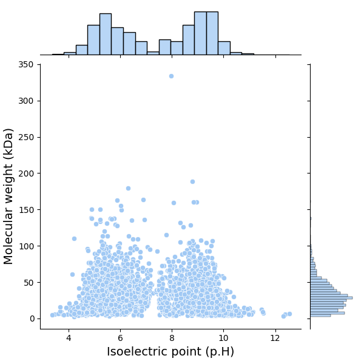
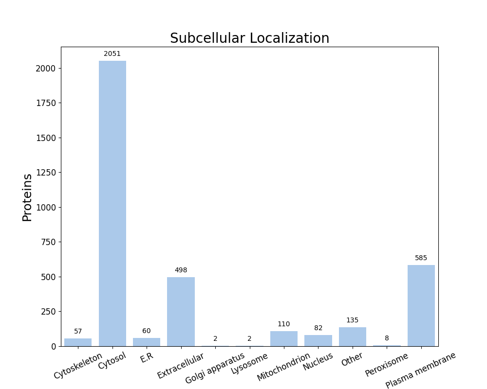

FastProtein Software 1.0
========================
##### Protein Information Software

---
### Summary
| Information                          | Value              |
| ------------------------------------ | ------------------ |
| Processed proteins                   | 3590               |
| Molecular mass (kda) mean            | 33.19 &#177; 22.87 |
| Isoelectric point mean               | 7.40 &#177; 1.85   |
| Hydrophicity mean                    | -0.17 &#177; 0.49  |
| Aromaticity mean                     | 0.09 &#177; 0.04   |
| Proteins with TM                     | 885                |
| Proteins with SP                     | 336                |
| Proteins with GPI                    | 16                 |
| Membrane proteins                    | 895                |
| Proteins with E.R Retention domains  | 465                |
| Proteins with NGlycosylation domains | 2569               |
### Molecular mass (kDa) vs Isoelectric point (pH)

---
### Subcellular localization (by WolfPSort) - Organism: animal

| Subcellular localization | Proteins |
| ------------------------ | -------- |
| Cytosol                  | 2051     |
| Plasma membrane          | 585      |
| Extracellular            | 498      |
| Other                    | 135      |
| Mitochondrion            | 110      |
| Nucleus                  | 82       |
| E.R                      | 60       |
| Cytoskeleton             | 57       |
| Peroxisome               | 8        |
| Lysosome                 | 2        |
| Golgi apparatus          | 2        |
---
### E.R Retention domain summary
| Domain | Quantity |
| ------ | -------- |
| KEEL   | 103      |
| KDEL   | 33       |
| ADEL   | 23       |
| AEEL   | 37       |
| KNEL   | 48       |
| ANEL   | 26       |
| REEL   | 46       |
| QEEL   | 20       |
| SDEL   | 18       |
| SEEL   | 44       |
Only top 10

---
### NGlyc domain summary
| Domain | Quantity |
| ------ | -------- |
| NNS    | 290      |
| NLS    | 458      |
| NNT    | 245      |
| NKT    | 322      |
| NKS    | 413      |
| NLT    | 276      |
| NIT    | 367      |
| NIS    | 573      |
| NVS    | 266      |
| NSS    | 296      |
Only top 10

---
| Id     | Length |  kDa   | Isoelectric_Point | Hydropathy | Aromaticity | Localization | TMHMM_2 | Phobius_TM | PredGPI | Membrane_evidences | Membrane_evidences_detail |  SignalP5   | Phobius_SP | ER_Retention_Total | NGlyc_Total |    ER_Retention_Domains     |                                                                                                                           NGlyc_Domains                                                                                                                            |                                Header                                 | Local_alignment_description | Gene_Ontology | Interpro_Annotation | PFAM_Annotation | Panther_Annotation |
| ------ |:------:|:------:|:-----------------:|:----------:|:-----------:|:------------:|:-------:|:----------:|:-------:|:------------------:|:-------------------------:|:-----------:|:----------:|:------------------:|:-----------:|:---------------------------:|:------------------------------------------------------------------------------------------------------------------------------------------------------------------------------------------------------------------------------------------------------------------:|:---------------------------------------------------------------------:| --------------------------- | ------------- | ------------------- | --------------- | ------------------ |
| P0DPI1 |  1296  | 149.43 |       6.05        |   -0.37    |    0.12     |   Cytosol    |    0    |     0      |    -    |         0          |                           |      -      |     -      |         1          |     19      |        SEEL[145-149]        | NLT[173-176];NYT[382-385];NFT[411-414];NFT[417-420];NFT[469-472];NIS[492-495];NIS[513-516];NLS[518-521];NES[773-776];NNT[841-844];NTS[874-877];NFS[939-942];NNS[969-972];NIS[1005-1008];NNS[1024-1027];NQS[1089-1092];NSS[1150-1153];NAS[1195-1198];NLS[1215-1218] |                      Botulinum neurotoxin type A                      | -                           |               |                     |                 |                    |
| A5HY28 |  533   | 60.05  |       6.21        |   -0.36    |    0.08     |   Cytosol    |    0    |     0      |    -    |         0          |                           |      -      |     Y      |         0          |      6      |                             |                                                                                             NLS[82-85];NVT[88-91];NYS[268-271];NLS[286-289];NTT[290-293];NDT[320-323]                                                                                              |                             CTP synthase                              | -                           |               |                     |                 |                    |
| A5HZ59 |  317   | 35.85  |       5.77        |   -0.24    |    0.10     |   Cytosol    |    0    |     0      |    -    |         0          |                           |      -      |     -      |         1          |      2      |        KDEL[202-206]        |                                                                                                                     NVS[174-177];NNS[274-277]                                                                                                                      |                 N(5)-(carboxyethyl)ornithine synthase                 | -                           |               |                     |                 |                    |
| A5I133 |  491   | 55.23  |       5.47        |   -0.33    |    0.10     |   Cytosol    |    0    |     0      |    -    |         0          |                           |      -      |     -      |         0          |      4      |                             |                                                                                                          NYS[42-45];NKT[68-71];NYT[207-210];NMT[256-259]                                                                                                           |                  Protein nucleotidyltransferase YdiU                  | -                           |               |                     |                 |                    |
| A5I1T6 |  483   | 54.68  |       6.08        |   -0.40    |    0.08     |   Cytosol    |    0    |     0      |    -    |         0          |                           |      -      |     -      |         0          |      2      |                             |                                                                                                                     NLT[201-204];NLS[393-396]                                                                                                                      | UDP-N-acetylmuramoyl-L-alanyl-D-glutamate--2,6-diaminopimelate ligase | -                           |               |                     |                 |                    |
| A5I4N2 |  237   | 27.69  |       6.98        |   -0.61    |    0.09     |   Cytosol    |    0    |     0      |    -    |         0          |                           |      -      |     -      |         0          |      1      |                             |                                                                                                                            NVT[200-203]                                                                                                                            |                            Ribonuclease 3                             | -                           |               |                     |                 |                    |
| A5I4T4 |  342   | 39.03  |       8.88        |   -0.31    |    0.08     |   Cytosol    |    0    |     0      |    -    |         0          |                           |      -      |     -      |         0          |      5      |                             |                                                                                                  NLT[127-130];NVT[165-168];NIT[206-209];NKT[245-248];NDS[262-265]                                                                                                  |         Probable dual-specificity RNA methyltransferase RlmN          | -                           |               |                     |                 |                    |
| A5I4U0 |  395   | 43.38  |       9.10        |   -0.12    |    0.06     |   Cytosol    |    0    |     0      |    -    |         0          |                           |      -      |     -      |         0          |      1      |                             |                                                                                                                            NKS[207-210]                                                                                                                            |          Coenzyme A biosynthesis bifunctional protein CoaBC           | -                           |               |                     |                 |                    |
| A5I4U9 |  332   | 36.37  |       6.06        |   -0.02    |    0.06     |     E.R      |    0    |     0      |    -    |         0          |                           |      -      |     Y      |         1          |      0      |        KEEL[121-125]        |                                                                                                                                                                                                                                                                    |             Glycerol-3-phosphate dehydrogenase [NAD(P)+]              | -                           |               |                     |                 |                    |
| A5I5V0 |  401   | 44.27  |       5.43        |   -0.17    |    0.05     |   Cytosol    |    0    |     0      |    -    |         0          |                           |      -      |     -      |         0          |      0      |                             |                                                                                                                                                                                                                                                                    |                 Riboflavin biosynthesis protein RibBA                 | -                           |               |                     |                 |                    |
| A5I6G4 |  830   | 92.70  |       9.36        |   -0.59    |    0.09     |     E.R      |    0    |     1      |    -    |         1          |        PHOBIUS_TM         |      -      |     -      |         0          |     11      |                             |                                                           NVT[117-120];NKS[198-201];NRT[238-241];NTS[476-479];NGT[524-527];NSS[619-622];NGT[690-693];NNS[763-766];NNS[796-799];NNT[809-812];NDS[816-819]                                                           |                     Penicillin-binding protein 1A                     | -                           |               |                     |                 |                    |
| A5I6N1 |  330   | 36.87  |       6.04        |   -0.17    |    0.09     |   Cytosol    |    0    |     0      |    -    |         0          |                           |      -      |     -      |         0          |      2      |                             |                                                                                                                      NSS[95-98];NCS[128-131]                                                                                                                       |                 Aspartate-semialdehyde dehydrogenase                  | -                           |               |                     |                 |                    |
| A5I6Y8 |  199   | 22.60  |       5.63        |   -0.49    |    0.09     |   Cytosol    |    0    |     0      |    -    |         0          |                           |      -      |     -      |         0          |      0      |                             |                                                                                                                                                                                                                                                                    |                       dITP/XTP pyrophosphatase                        | -                           |               |                     |                 |                    |
| A5I766 |  658   | 73.70  |       5.24        |   -0.36    |    0.06     |     E.R      |    0    |     2      |    -    |         1          |        PHOBIUS_TM         |      -      |     -      |         0          |      3      |                             |                                                                                                               NET[157-160];NCS[543-546];NET[609-612]                                                                                                               |                ATP-dependent zinc metalloprotease FtsH                | -                           |               |                     |                 |                    |
| A5I7C4 |  500   | 55.60  |       5.94        |   -0.12    |    0.08     |   Cytosol    |    0    |     0      |    -    |         0          |                           |      -      |     -      |         0          |      6      |                             |                                                                                            NYS[13-16];NTT[179-182];NNT[327-330];NKT[341-344];NST[425-428];NAT[481-484]                                                                                             |              Bifunctional NAD(P)H-hydrate repair enzyme               | -                           |               |                     |                 |                    |
| A5I7Q0 |  601   | 66.37  |       6.00        |   -0.19    |    0.07     |     E.R      |    0    |     2      |    -    |         1          |        PHOBIUS_TM         | SP(Sec/SPI) |     -      |         2          |      5      | KEEL[167-171];AQEL[579-583] |                                                                                                    NST[29-32];NFS[34-37];NES[372-375];NFS[540-543];NIS[571-574]                                                                                                    |                ATP-dependent zinc metalloprotease FtsH                | -                           |               |                     |                 |                    |
| A5I7R9 |  319   | 34.75  |       5.81        |    0.04    |    0.06     |   Cytosol    |    0    |     0      |    -    |         0          |                           |      -      |     -      |         0          |      2      |                             |                                                                                                                      NET[48-51];NVS[204-207]                                                                                                                       |                  Ribose-phosphate pyrophosphokinase                   | -                           |               |                     |                 |                    |
| A5I7S0 |  457   | 50.13  |       6.80        |   -0.27    |    0.06     |   Cytosol    |    0    |     0      |    -    |         0          |                           |      -      |     -      |         0          |      3      |                             |                                                                                                                NVT[66-69];NET[108-111];NDT[269-272]                                                                                                                |                       Bifunctional protein GlmU                       | -                           |               |                     |                 |                    |
| A5HXP7 |  448   | 51.32  |       8.31        |   -0.41    |    0.08     | Cytoskeleton |    0    |     0      |    -    |         0          |                           |      -      |     -      |         0          |      1      |                             |                                                                                                                             NNS[38-41]                                                                                                                             |            Chromosomal replication initiator protein DnaA             | -                           |               |                     |                 |                    |
| A5HXQ2 |  637   | 71.56  |       5.51        |   -0.39    |    0.08     |   Cytosol    |    0    |     0      |    -    |         0          |                           |      -      |     -      |         0          |      1      |                             |                                                                                                                            NLS[310-313]                                                                                                                            |                         DNA gyrase subunit B                          | -                           |               |                     |                 |                    |
| A5HXQ3 |  836   | 94.53  |       5.53        |   -0.40    |    0.05     |   Cytosol    |    0    |     0      |    -    |         0          |                           |      -      |     -      |         2          |      5      | KEEL[456-460];KEEL[465-469] |                                                                                                   NFS[93-96];NGS[167-170];NLT[184-187];NLS[411-414];NVS[770-773]                                                                                                   |                         DNA gyrase subunit A                          | -                           |               |                     |                 |                    |
| A5HXR1 |  426   | 48.75  |       5.58        |   -0.58    |    0.09     |   Cytosol    |    0    |     0      |    -    |         0          |                           |      -      |     -      |         0          |      5      |                             |                                                                                                    NNS[8-11];NLS[79-82];NWS[127-130];NRT[202-205];NGS[384-387]                                                                                                     |                          Serine--tRNA ligase                          | -                           |               |                     |                 |                    |
| A5HXS0 |  295   | 34.18  |       9.25        |   -0.38    |    0.14     |   Cytosol    |    0    |     0      |    -    |         0          |                           |      -      |     -      |         0          |      6      |                             |                                                                                             NWT[23-26];NQS[77-80];NYS[133-136];NDS[142-145];NGT[151-154];NQS[274-277]                                                                                              |              Phosphatidylserine decarboxylase proenzyme               | -                           |               |                     |                 |                    |
| A5HXS4 |  400   | 43.48  |       5.72        |   -0.02    |    0.08     |   Cytosol    |    0    |     0      |    -    |         0          |                           |      -      |     -      |         0          |      0      |                             |                                                                                                                                                                                                                                                                    |                       L-methionine gamma-lyase                        | -                           |               |                     |                 |                    |
| A5HXS5 |  145   | 16.15  |       8.19        |    0.00    |    0.07     |   Cytosol    |    0    |     0      |    -    |         0          |                           |      -      |     -      |         0          |      2      |                             |                                                                                                                     NIT[111-114];NNS[114-117]                                                                                                                      |                   tRNA-specific adenosine deaminase                   | -                           |               |                     |                 |                    |
| A5HXU4 |  247   | 27.79  |       7.64        |   -0.30    |    0.09     |   Cytosol    |    0    |     0      |    -    |         0          |                           |      -      |     -      |         0          |      2      |                             |                                                                                                                      NYS[46-49];NSS[145-148]                                                                                                                       |                   NAD-dependent protein deacetylase                   | -                           |               |                     |                 |                    |
##### Only top 10 proteins

---

##### Do you have a question or tips? Please contact us! E-mail: renato.simoes@ifsc.edu.br
Generated time: Mon Apr 06 23:43:38 UTC 2026